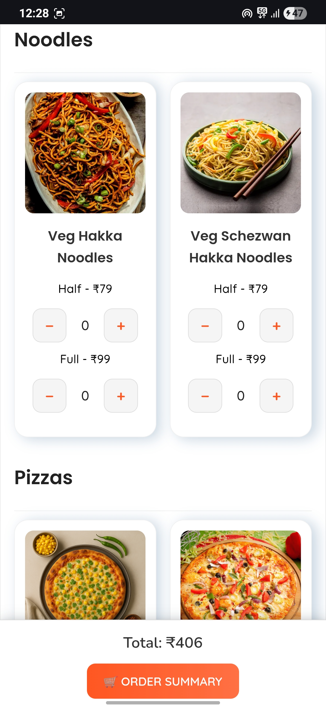
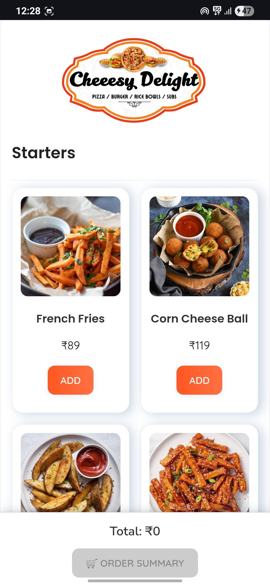
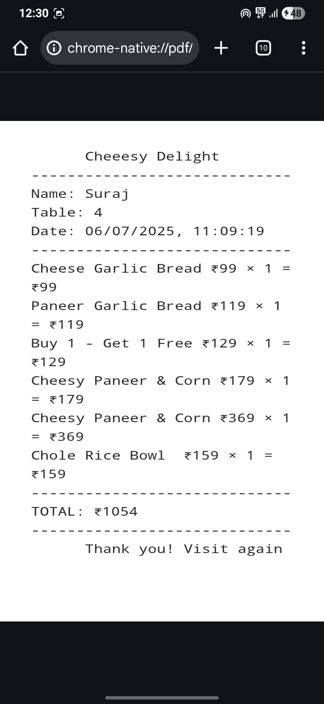

# 🍕 Cheesy Delight – QR-Based Restaurant Ordering System

A clean, mobile-first web application for cafes and restaurants that enables customers to browse the menu, place orders, and view bills—all by simply scanning a QR code. No app installation required.

---

## 🌐 Live Experience

> ⚠️ For privacy and security reasons, the live deployment link is restricted.  
> Please contact the developer for a private walkthrough or demo access.

---

## 🚀 Project Overview

**Cheesy Delight** simplifies dine-in ordering with an intuitive web-based system built using:

- ✅ HTML, CSS & Vanilla JavaScript
- 🔥 Firebase Realtime Database & Hosting
- 📱 Mobile-first responsive layout
- 🔐 Admin panel for managing menu and orders
- 🧾 Customer UI with full menu, order summary, and billing
- 👨‍🍳 Kitchen panel to manage live orders

---

## 🖥️ Application Modules

### 1️⃣ Customer Interface

> Designed for customers scanning a QR code at their table

#### 🏠 Home Screen

#### 📋 Menu
  

#### 🛒 Order Summary

#### 💳 Final Bill

#### ⏳ Loading Animation

---

### 2️⃣ Kitchen Order Panel

> Helps kitchen staff view and manage real-time incoming orders

---

### 3️⃣ Admin / Owner Dashboard

> Provides the restaurant owner with control over the system

#### 🔧 Owner Panel

#### 📊 Stats Dashboard

---

## 📁 Folder Structure

menu/
├── Customer_UI/
│ ├── Home Screen.jpg
│ ├── Menu.jpg
│ ├── Menu1.jpg
│ ├── Order summary.jpg
│ ├── Bill.jpg
│ └── Loading animation.jpg
├── Kitchen_UI/
│ └── Kitchen Order Panel.png
├── Owner_UI/
│ ├── Owners Panel.jpg
│ └── Owners Stats.jpg
├── index.html
├── admin.html
├── kitchen.html
└── README.md

---

## 💡 How It Works

1. Customer scans a QR code and is taken to the menu page.
2. They select items, view order summary, and place the order.
3. The order reflects in the **Kitchen Panel** instantly.
4. Admin/Owner monitors all orders and performance in real-time via Firebase.

---

